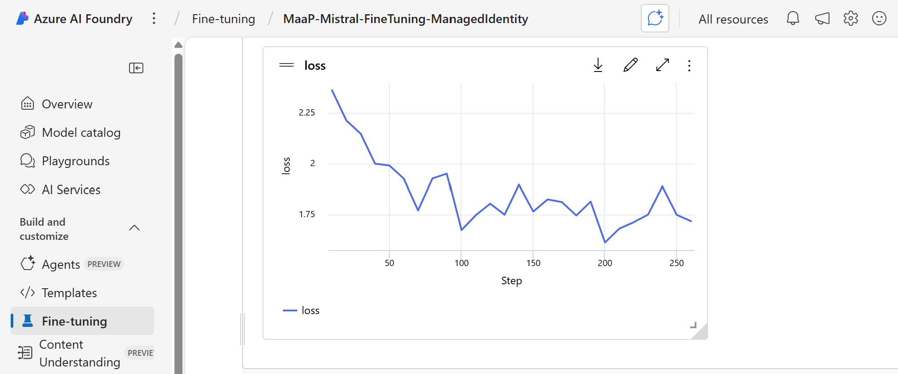

# Fine-Tuning Mistral-7B in Azure AI Foundry

This guide walks you through the process of fine-tuning Mistral 7B AI model in **Azure AI Foundry**. It covers steps of checking prerequisites, configuring your environment and submitting a fine-tuning job on MaaP (Model-as-a-Platform) using Managed Identity.

> [!NOTE]
> The Python code and training datasets in this repo are adapted from Microsoft's [Azure Machine Learning examples](https://github.com/Azure/azureml-examples/tree/main/sdk/python/jobs/finetuning) repo.

## 📑 Table of Contents
- [Prerequisites](#prerequisites)
- [Step 1: Environment Setup](#step-1-environment-setup)
- [Step 2: Job Payload Definition](#step-2-job-payload-definition)
- [Step 3: Job Submission](#step-3-job-submission)
- [Step 4: Monitoring Job Status](#step-4-monitoring-job-status)
- [Step 5: Endpoint Deployment](#step-5-endpoint-deployment-optional)

## Prerequisites
Before you begin, ensure you have the following:
- **Azure AI Project**: Make sure your project is created and accessible;
- **Managed Identity**: If using a *User-Assigned Managed Identity*, ensure that it has the *Storage Blob Data Contributor* RBAC role assigned to access the **AI Hub's storage account**;
- **Python Packages**: Install the necessary Python packages for interacting with Azure AI Foundry and Entra ID.
``` PowerShell
pip install azure-identity azure-ai-ml
```
> [!WARNING]
> Fine-tuning of non-Azure-OpenAI models on MaaP is currently in Preview mode. Your subscription must be allow-listed to access this functionality.

## Step 1: Environment Setup
Set up your environment variables to make provided Jupyter notebook work:

| Variable                     | Description                                      |
| ---------------------------- | ------------------------------------------------ |
| `SUBSCRIPTION_ID`            | Azure subscription ID.                           |
| `RESOURCE_GROUP`             | Azure ML resource group name.                    |
| `WORKSPACE_NAME`             | Azure ML workspace name.                         |
| `MANAGED_IDENTITY_OBJECTID`  | ObjectID of AI Hub's managed identity.           |

## Step 2: Job Payload Definition
(Details on how to define the job payload would be added here if provided in the original context.)

## Step 3: Job Submission
(Details on how to submit the job would be added here if provided in the original context.)

## Step 4: Monitoring Job Status
You can monitor the job in the Azure AI Studio portal or poll the job status using the REST API.


## Step 5: Endpoint Deployment (Optional)
Once the job completes successfully, you can register and deploy the model using Azure AI Studio or the REST API. Please note that deployment steps are not yet fully supported via Foundry REST for all models.
